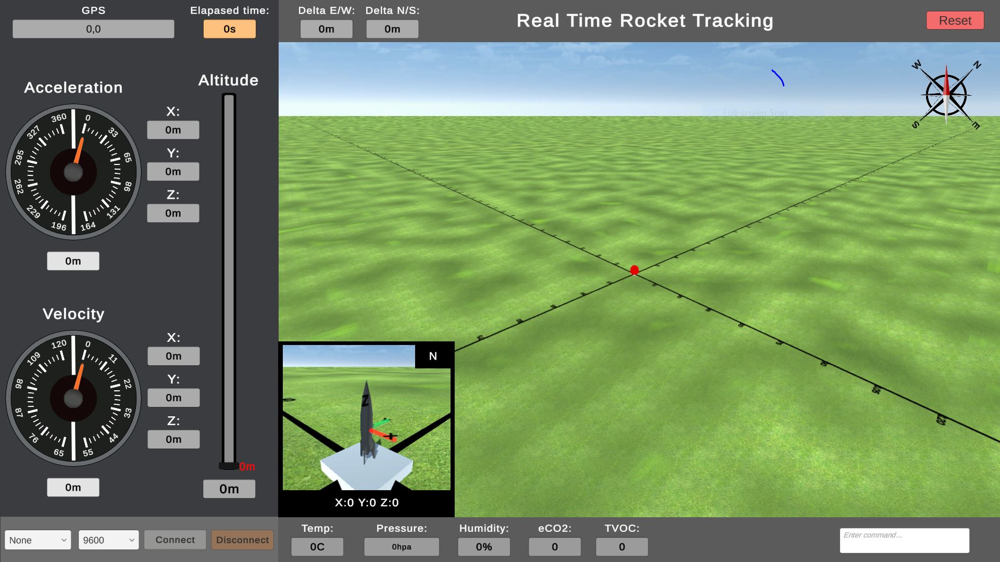

# Ground Station Display Software

Real-time 3D visualization interface for the **AIAA OC Section** [NASA SLI](https://www.nasa.gov/learning-resources/nasa-student-launch/) 2024-2025 payload telemetry system.

> **Note:** This is a side repository for the ground station display. For the other part of the project including flight software and ground station control software, see the [main repository](https://github.com/shenjason/TeleMeSomeMoreData--SLI2024-2025).

## Overview

Unity-based display application that receives telemetry data from the ground station and provides:

- **Real-time rocket tracking** — 3D visualization of rocket position and orientation
- **Flight telemetry gauges** — Acceleration, velocity, and altitude displays
- **Environmental data** — Temperature, pressure, humidity, eCO2, and TVOC readings
- **GPS tracking** — Live position with delta E/W and N/S indicators

## License

MIT License
